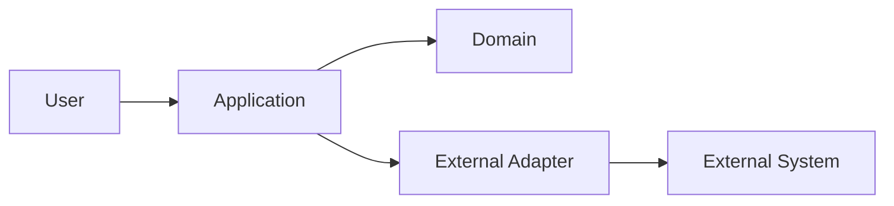
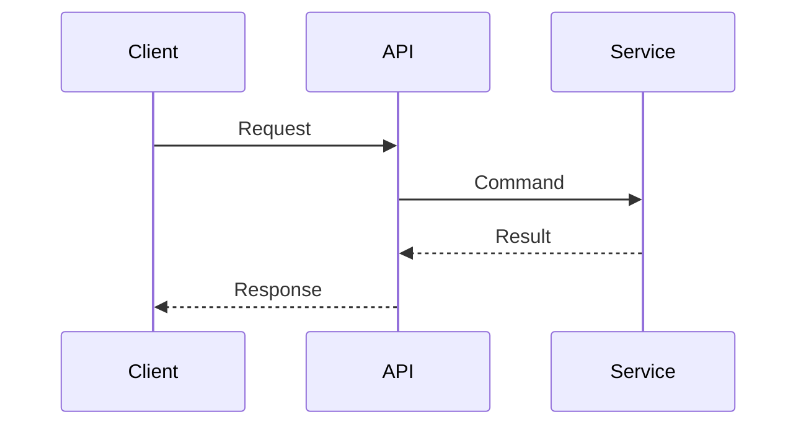

# System Diagram

## Objective

Create or update lightweight architecture diagrams that explain system context, containers, components, data flow, dependencies, or deployment relationships using project evidence.

## Workflow

1. Read the effective context index generated for the project.
2. Identify the diagram purpose: explain current state, proposed design, migration, integration, dependency direction, or deployment.
3. Inspect relevant architecture docs, ADRs, specs, and code paths before drawing relationships.
4. Choose the smallest useful diagram level: context, container, component, sequence, data flow, dependency, or deployment.
5. Prefer Mermaid markdown when the project has no stronger diagram convention.
6. Label boundaries, ownership, external systems, protocols, storage, and direction of dependency or data flow.
7. Distinguish current state from proposed state. Do not mix them in one unlabeled diagram.
8. Store or update the diagram in the relevant project documentation path and link it from related architecture docs or ADRs.
9. Verify syntax when a renderer or markdown preview command is available.

## Mermaid Patterns

## Anti Patterns

- Drawing diagrams from assumptions instead of repository evidence.
- Creating large diagrams that mix every system detail into one unreadable view.
- Omitting direction, ownership, or boundary labels.
- Mixing proposed and current architecture without explicit labels.
- Treating diagrams as a substitute for ADRs or architecture notes.
